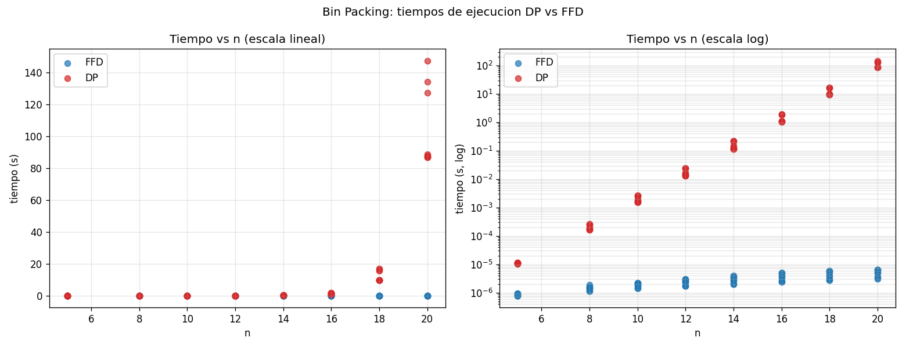

# Discusión final: aplicabilidad del greedy para Bin Packing

Esta sección cierra el proyecto comparando los dos algoritmos (DP exacta con
bitmask y FFD greedy) en base a los resultados teóricos de los docs 02–05 y
al análisis empírico de `results/`.

---

## 1. Resumen de lo encontrado

Lo principal es que el problema Bin Packing **sí tiene subestructura óptima**
pero **no cumple la greedy choice property**. Eso se vio en docs/02 y docs/05.
Por eso la DP exacta encuentra el óptimo y FFD no lo garantiza.

En la práctica, lo que se observó es:

- La DP es correcta pero su tiempo crece muy rápido. Con n = 20 ya toma
  entre 85 y 150 segundos por instancia.
- FFD es órdenes de magnitud más rápido (microsegundos para los mismos n).
- En 72 instancias aleatorias el ratio FFD/OPT salió 1.0000. Solo se ve la
  diferencia cuando se usan instancias adversariales construidas a propósito,
  donde el ratio sube a 1.20 - 1.25.

---

## 2. Tiempo de ejecución

Los datos del benchmark están en `results/tiempos.csv` y la regresión en
`results/regresion.md`. El diagrama de dispersión (entregable 5b) se ve así:

El panel izquierdo (escala lineal) hace evidente que DP explota a partir de
n = 18, mientras FFD se mantiene pegado al cero. El panel derecho (escala
log) muestra que la DP crece de forma claramente exponencial y FFD crece de
forma polinomial suave.

### DP

- Teórica: O(3ⁿ) tiempo, O(2ⁿ) espacio.
- Empírica: ajuste log-lineal `t ≈ 4.25e-8 · 2.94ⁿ`. La base 2.94 está muy
  cerca del 3 teórico, lo que confirma el análisis asintótico.
- Polinomial: el mejor ajuste polinomial es grado 5 con R² = 0.94, pero esto
  es solo un truco numérico: la curva real no es polinomial.

### FFD

- Teórica: O(n log n + n²) = O(n²) con la implementación ingenua de listas.
- Empírica: los tiempos quedan en el rango de 1–7 microsegundos para n entre
  5 y 20. El R² polinomial salió bajo (0.74) por el ruido relativo al medir
  microsegundos, pero la forma sigue siendo polinomial suave.

### Diferencia en escala

A n = 20 la DP tarda casi 10⁷ veces más que FFD. Esa diferencia es
exactamente lo que la teoría predice y es la razón principal por la que
los heurísticos greedy son útiles en este problema.

---

## 3. Calidad de la solución

Aquí la teoría y la
práctica parecen contradecirse a primera vista.

- La teoría (docs/05) dice que FFD no garantiza el óptimo, y hay un
  contraejemplo concreto donde FFD usa 5 bins y la solución óptima usa 4.
- La cota conocida es `FFD ≤ (11/9)·OPT + 6/9`, aproximadamente 1.222·OPT + 0.667.
- En el benchmark con 72 instancias aleatorias (uniformes, sesgadas a items
  grandes y sesgadas a items pequeños) el ratio FFD/OPT salió **1.0000 en
  todas**.
- Cuando se agregan 3 instancias adversariales construidas a mano el ratio
  máximo sube a **1.2500**, justo en el límite que la cota teórica permite.

La interpretación es que **para instancias aleatorias en los rangos de n y
distribuciones probadas, FFD ya da el óptimo casi siempre**, aunque eso no
sea una garantía universal. Las instancias donde FFD falla son patrones
específicos: números de items y tamaños estructurados que crean
desperdicio acumulado al colocarlos en orden decreciente.

---

## 4. Cuándo usar cada algoritmo

| Situación | Recomendación |
|---|---|
| n pequeño (≤ 18) y se necesita el óptimo seguro | DP exacta. |
| n mediano o grande, y se permite +20% de bins en el peor caso | FFD. |
| Instancias generadas por usuarios / sin estructura adversarial | FFD suele ser óptimo en la práctica. |
| Aplicación crítica donde 1 bin extra cuesta caro | DP si n lo permite, o algoritmos exactos especializados (Korf 2002). |
| Tiempo real / online | FFD u otros greedy (First Fit, Best Fit). |

En la mayoría de aplicaciones reales (carga de camiones, asignación de
memoria, scheduling de tareas) los tamaños no están diseñados para
romper FFD, así que el greedy es muy aplicable.

---

## 5. Conclusión sobre la greedy choice property

Como Bin Packing no cumple la GCP, no hay forma de construir un greedy
óptimo en general. Lo mejor que se puede hacer es:

1. Aceptar que el greedy es una heurística con cota de aproximación.
2. Usar la DP cuando n sea pequeño y se necesite óptimo.
3. Si n es grande y se requiere algo cercano al óptimo, combinar greedy
   con búsqueda local o branch-and-bound. Esto sale del alcance del
   proyecto pero es la dirección natural.

---

## 6. Aplicabilidad final del greedy

El acercamiento greedy es **aplicable y práctico** para Bin Packing, con
estas observaciones:

- Es la única opción viable para n grande (la DP no escala).
- En la mayoría de casos aleatorios da el óptimo o muy cerca.
- Tiene una cota teórica de 11/9 ≈ 1.222 sobre el óptimo, lo que es una
  garantía razonable.
- No reemplaza a la DP cuando el óptimo es estrictamente necesario y n es
  pequeño.

En resumen, FFD es un buen ejemplo de un greedy que **no es óptimo en
teoría pero sí es muy bueno en la práctica**, y de un problema donde la
brecha entre teoría (NP-dificultad) y heurísticas eficientes hace que el
acercamiento greedy sea la herramienta principal en aplicaciones reales.
